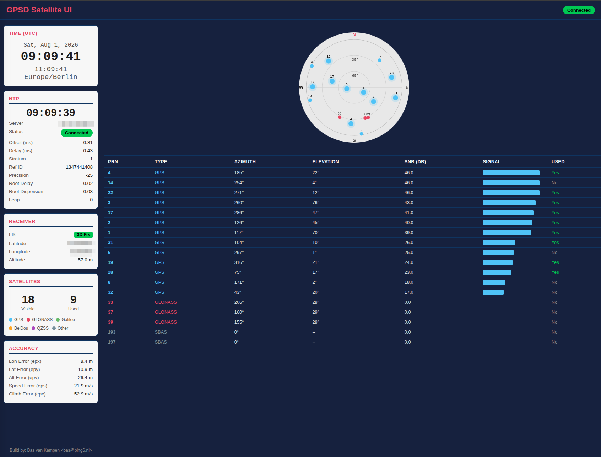

# GPSD Web UI



Real-time GPS satellite monitoring dashboard with polar sky plot and NTP time display.

## Features

- Polar sky plot showing satellite positions by azimuth/elevation
- GNSS constellation color coding (GPS, Galileo, GLONASS, BeiDou, SBAS)
- Satellite table with PRN, type, coordinates, signal strength, and usage status
- GPS time display with live incrementing seconds
- NTP time synchronization with offset, delay, stratum, and precision
- WebSocket real-time updates
- Containerized deployment with Kubernetes support

## Quick Start

### Local

```bash
pip install -r requirements.txt
cp config.example.yaml config.yaml
# Edit config.yaml with your settings
python3 run.py
```

### Docker

```bash
docker build -t gpsd-ui .
docker run -p 5000:5000 --env-file .env gpsd-ui
```

## Configuration

Configuration via `config.yaml` or environment variables (env vars override config.yaml):

| Env Var | Default | Description |
|---------|---------|-------------|
| `GPSD_HOST` | localhost | GPS daemon host |
| `GPSD_PORT` | 2947 | GPS daemon port |
| `NTP_ENABLED` | false | Enable NTP display |
| `NTP_HOST` | pool.ntp.org | NTP server |
| `NTP_INTERVAL` | 5 | NTP query interval (seconds) |
| `WEB_HOST` | 0.0.0.0 | Flask bind address |
| `WEB_PORT` | 5000 | Flask port |
| `LOG_LEVEL` | INFO | Logging level |

## Architecture

```
gpsd-ui/
├── app/
│   ├── __init__.py        # Flask app, routes, socketio events
│   ├── config.py          # YAML/env config loader
│   ├── gpsd_reader.py     # GPSD socket reader thread
│   └── ntp_reader.py      # NTP query thread
├── static/
│   ├── style.css          # CSS styles
│   └── app.js             # JavaScript (WebSocket, polar plot, tables)
├── templates/
│   └── index.html         # HTML template
├── config.example.yaml    # Example config
├── Dockerfile
└── requirements.txt
```

## Tech Stack

- **Backend**: Python, Flask, Flask-SocketIO, gevent
- **Frontend**: Vanilla JavaScript, Socket.IO, HTML5 Canvas
- **Data sources**: gpsd (socket), NTP (ntplib)

## License

[MIT License](LICENSE) - Author: Bas van Kampen <bas@ping6.nl>
